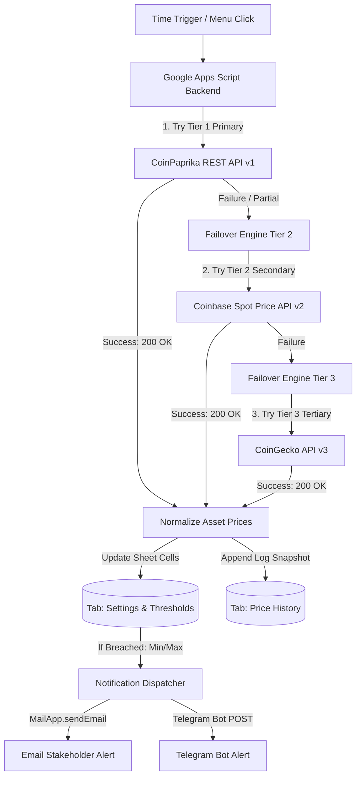

# 📈 Automated Crypto & Currency API Tracker with Triple-Tier Failover Engine

An enterprise-grade, fault-tolerant financial tracking backend built on **Google Sheets** and **Google Apps Script (GAS)**. Featuring a **Triple-Tier Universal Failover Architecture (`CoinPaprika` ➔ `Coinbase` ➔ `CoinGecko`)**, this system fetches real-time cryptocurrency and asset prices without falling victim to cloud IP restrictions (`HTTP 429` rate limits or `HTTP 451` geo-blocking). It maintains an audit-ready historical log and dispatches instant **Email** and **Telegram Bot** alerts when custom KPI boundaries (`Min/Max Thresholds`) are crossed.

---

## 💡 Business Value & Solving Real-World Cloud API Limitations

When automating external REST API calls from cloud environments like Google Apps Script or AWS Lambda, single-source public APIs often fail due to two critical infrastructure barriers:
1. **IP Rate Limits (`HTTP 429 Too Many Requests`):** Free endpoints like `CoinGecko` limit requests across shared cloud datacenters.
2. **Geo-Blocking Restrictions (`HTTP 451 Unavailable For Legal Reasons`):** Exchanges like `Binance` block all traffic originating from US datacenters (where Google Apps Script cloud servers run).

This portfolio solution demonstrates senior-level architectural resilience by solving both problems simultaneously:
- **Tier 1 (Primary): `CoinPaprika REST API v1`** — High-throughput public market data with **zero US geo-blocking** and high rate limits.
- **Tier 2 (Secondary Failover): `Coinbase Public Spot API v2`** — A regulated US-native exchange API immune to US server restrictions, serving instant spot prices for BTC, ETH, and SOL.
- **Tier 3 (Tertiary Fallback): `CoinGecko API v3`** — Universal fallback engine with custom HTTP headers.

If any tier experiences downtime or rate limits, the failover engine catches the exception and routes data collection to the next available tier with **zero downtime**.

---

## 🛠 Triple-Tier Failover System Architecture

---

## ✨ Key Technical Features

- **🛡️ Universal Fault Tolerance:** Immune to cloud datacenter IP restrictions (`HTTP 429` / `HTTP 451`). Automatically switches between 3 global API providers.
- **🎛 Custom Spreadsheet Toolbar Menu:** Adds a dedicated `⚡ Automation (API Tracker)` menu inside Google Sheets with options for instant updates, structure initialization, and one-click trigger setup.
- **📊 Dynamic Price Thresholds:** Each tracked asset supports configurable boundaries (`Min Threshold`, `Max Threshold`). When breached, asset status updates immediately to `🔥 ABOVE MAX` or `❄️ BELOW MIN`.
- **⚡ High-Performance Batch Processing:** To avoid Google Apps Script execution quotas and timeouts, historical entries are aggregated in memory and written via a single batch `Range.setValues()` call.

---

## 🚀 Quickstart & Setup Guide

1. Create a blank spreadsheet in [Google Sheets](https://sheets.google.com).
2. Navigate to **Extensions → Apps Script**.
3. Copy the entire contents of `Code.gs` from this repository and paste it into the editor.
4. Click **Save (💾)** and refresh your Google Sheets browser tab.
5. Click **`⚡ Automation (API Tracker) → 🛠 Initialize Spreadsheet Structure`** to format your sheets.
6. Click **`⚡ Automation (API Tracker) → 🔄 Update Prices Now`** to see the Triple-Tier Failover engine update your table!

---

## 👤 Developer / Freelance Hire & Customization

This project was engineered to showcase senior backend automation capabilities utilizing **Google Workspace APIs**, **Google Apps Script ES6+**, and **resilient multi-tier REST failover architecture**.

**Need custom fault-tolerant automation, CRM/Sheets integrations, or bespoke workflow development? Reach out to discuss your project requirements!**
